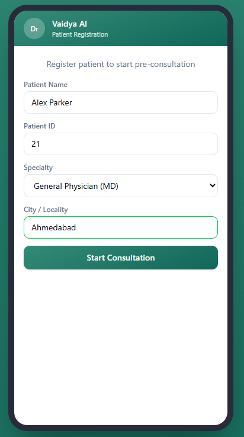
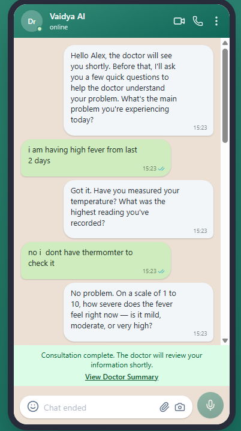

# Vaidya AI — Pre-Consultation Medical Intake

AI-powered pre-consultation intake system that collects patient symptoms before they see the doctor. Saves doctor's time, reduces patient waiting experience, and provides structured clinical summaries with local health context awareness.

Deployed on AWS.

---

## How It Works

```
Patient registers (name, ID, specialty, city)
        ↓
Local Health Context Service gathers seasonal + regional health info
        ↓
AI conducts doctor-like intake (adaptive: up to 8 questions)
        ↓
Structured clinical summary generated for the doctor
```

1. Reception registers patient with name, ID, specialty, and city
2. System gathers local health context (season, regional health trends via real-time web search)
3. AI greets the patient and asks specific, quantifiable, doctor-like questions
4. AI adapts based on answers — stops early if clear picture, probes deeper if vague
5. Provides season-aware Do's and Don'ts at the end (no medication advice)
6. Structured clinical summary with health context sources generated for the doctor

---

## Screenshots





---

## Tech Stack

| Component | Technology |
|-----------|-----------|
| Backend | Python 3.11+, FastAPI, Uvicorn |
| Frontend | React 19, TanStack Router, Vite, Tailwind CSS |
| AI/LLM | AWS Bedrock (Claude Haiku 4.5) via Converse API |
| Health Context | Real-time web search for local health trends |
| Deployment | AWS (EC2 + Elastic IP + S3 + CloudFront) |
| CI/CD | GitHub Actions (auto-deploy on push to main) |
| Sessions | In-memory (production DB planned) |

---

## Features

- Doctor-like questioning — asks for measurements, numbers, timelines (not vague yes/no)
- Local Health Context — real-time search for regional health trends at registration
- Season-aware — adjusts questions and closing advice based on monsoon/winter/summer
- 8 specialty-specific prompts with targeted clinical questions
- Adaptive question limit — max 8 questions, stops early if enough info collected
- Emergency detection — chest pain, stroke signs, etc. alerts staff immediately
- Multi-language support — detects patient's language, stays in that language throughout
- Formatted doctor summary — clean card-style report with clinical data and sources
- No medication advice — only safe self-care Do's/Don'ts
- Session timeout — 30 min inactivity auto-expires with partial summary
- Hospital callback — auto-POST summary to hospital endpoint
- WhatsApp-style chat UI — familiar interface for patients

---

## Supported Specialties

- General Physician (MD)
- Cardiologist
- Neurologist
- Dermatologist
- Gastroenterologist
- Orthopedic
- ENT (Ear, Nose & Throat)
- Gynecologist

---

## API Endpoints

| Endpoint | Method | Description |
|----------|--------|-------------|
| `/api/v1/register-patient` | POST | Register patient, get first AI message |
| `/api/v1/chat` | POST | Send patient message, get AI response |
| `/api/v1/session/{id}/status` | GET | Check session status |
| `/api/v1/session/{id}/summary` | GET | Get clinical summary (after completion) |
| `/api/v1/session/{id}/history` | GET | Get conversation transcript |
| `/api/v1/hospital/{id}/sessions` | GET | List all sessions for a hospital |
| `/health` | GET | Health check |

---

## Project Structure

```
Vaidya-AI/
├── .github/workflows/
│   ├── deploy-backend.yml           # CI/CD: Docker → ECR → EC2
│   └── deploy-frontend.yml          # CI/CD: Build → S3 → CloudFront
├── backend/
│   ├── Dockerfile
│   ├── .dockerignore
│   ├── pyproject.toml
│   ├── .env.example
│   └── app/
│       ├── main.py                   # FastAPI app entry point
│       ├── config.py                 # Settings (loads .env)
│       ├── api/routes/
│       │   ├── registration.py       # POST /register-patient
│       │   ├── chat.py              # POST /chat
│       │   ├── sessions.py          # GET session status/summary/history
│       │   └── hospital.py          # GET hospital sessions list
│       ├── services/
│       │   ├── bedrock_service.py   # AWS Bedrock Converse API wrapper
│       │   ├── conversation_service.py  # Chat logic + question counter
│       │   ├── health_context_service.py # Local Health Context Service
│       │   ├── prompt_service.py    # Doctor-like prompts + context injection
│       │   ├── session_manager.py   # Session CRUD + 30min timeout
│       │   ├── summary_service.py   # Clinical summary generation
│       │   └── callback_service.py  # POST summary to hospital endpoint
│       └── models/
│           └── session.py           # Session + HealthContext dataclasses
├── frontend/
│   ├── index.html
│   ├── package.json
│   ├── vite.config.ts
│   └── src/
│       ├── main.tsx                  # App entry point
│       ├── routes/
│       │   ├── index.tsx            # Registration form + chat
│       │   └── summary.$sessionId.tsx # Formatted doctor summary page
│       ├── components/chat/
│       │   ├── ChatWindow.tsx       # Chat UI
│       │   └── MessageBubble.tsx    # Message bubble component
│       └── lib/chat-data.ts         # Types + API config
└── infra/
    ├── cloudformation.yaml          # AWS infrastructure
    ├── deploy.ps1                   # One-command deploy script
    └── DEPLOYMENT.md                # Full deployment guide
```

---

## Prerequisites

- Python 3.11+
- Node.js 18+
- AWS Account with Bedrock model access (Claude Haiku 4.5 in ap-south-1)
- Docker (for deployment)

---

## Quick Start (Local Development)

### Backend

```bash
cd backend
pip install -e .
cp .env.example .env   # Add your credentials
uvicorn app.main:app --reload --port 8000
```

### Frontend

```bash
cd frontend
npm install
npm run dev
```

- Chat UI: `http://localhost:5173`
- API Docs: `http://localhost:8000/docs`

---

## Deployment

Deployed on AWS using CloudFormation (EC2 + Elastic IP + S3 + CloudFront).

See [infra/DEPLOYMENT.md](infra/DEPLOYMENT.md) for full deployment guide.

CI/CD via GitHub Actions — push to `main` auto-deploys:
- Backend changes → builds Docker → pushes to ECR → deploys on EC2
- Frontend changes → builds SPA → uploads to S3 → invalidates CloudFront

---

## Architecture

```
Patient Browser
     │
     ▼
CloudFront (HTTPS)
     │
     ├── Static files (/) ──► S3 Bucket (Frontend SPA)
     │
     └── API calls (/api/*) ──► EC2 Instance (Elastic IP)
                                      │
                                      ├── FastAPI Backend
                                      ├── AWS Bedrock (Claude AI)
                                      └── Health Context (Web Search)
```

---

## License

Private — Internal use only.
